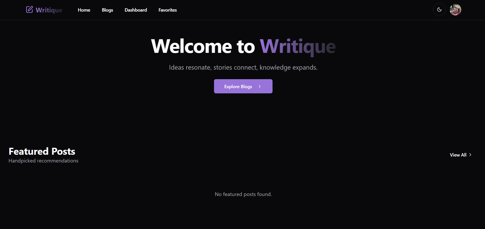

# Writique 🖋️

Writique is a modern, full-stack blog application built with the MERN stack, featuring user authentication, role-based access control, blog management, and image uploads via Cloudinary.


## ✨ Features

*   **User Authentication:** Secure sign-up, sign-in, and session management powered by Clerk.
*   **Blog Management:**
    *   Create, view, list, filter, and sort blog posts.
    *   Markdown support for blog content with syntax highlighting.
    *   Image uploads handled via Cloudinary.
*   **Role-Based Access:**
    *   **User Role:** Can create blogs, edit/delete their *own* blogs.
    *   **Admin Role:** Can manage (delete) *any* blog post, access the admin panel. (User management section is placeholder).
*   **Responsive Design:** UI adapts to different screen sizes (mobile, tablet, desktop) using Tailwind CSS.
*   **Theme Toggle:** Light and Dark mode support.
*   **API Backend:** Separate Node.js/Express backend managing data persistence with MongoDB.

## 🚀 Tech Stack

**Frontend:**

*   React (`v18+`)
*   Vite (Build Tool)
*   TypeScript
*   Tailwind CSS
*   Shadcn UI (Component Library)
*   Clerk (React SDK for Frontend Auth)
*   React Router DOM (`v6`)
*   `react-markdown`, `react-syntax-highlighter` (for content rendering)
*   `lucide-react` (Icons)

**Backend:**

*   Node.js (`v18+` recommended)
*   Express
*   TypeScript
*   MongoDB (with Mongoose ODM)
*   Clerk (Node SDK for Backend Auth)
*   Cloudinary (Node SDK for Image Uploads)
*   Multer (for handling file uploads in Express)
*   `cors`, `dotenv`

##📋 Prerequisites

*   Node.js (v18 or later recommended)
*   npm or yarn or pnpm
*   Git
*   MongoDB instance (e.g., a free tier on [MongoDB Atlas](https://www.mongodb.com/cloud/atlas/register) or a local installation)
*   A [Clerk](https://clerk.com/) account (for API keys)
*   A [Cloudinary](https://cloudinary.com/) account (for API keys and cloud name)

## ⚙️ Setup & Installation

This project uses **two separate repositories**: one for the frontend and one for the backend.

**1. Backend Setup (`writique-backend` repository):**

```bash
# 1. Clone the backend repository
git clone <your-backend-repo-url>
cd writique-backend

# 2. Install dependencies
npm install
# or yarn install / pnpm install

# 3. Create the environment file
cp .env.example .env # Or create .env manually

# 4. Configure backend environment variables in .env
#    (See Configuration section below)

# 5. Build the TypeScript code (needed for nodemon/start script)
npm run build
```

**2. Frontend Setup (`writique-frontend` repository):**

```bash
# 1. Clone the frontend repository
git clone <your-frontend-repo-url>
cd writique-frontend

# 2. Install dependencies
npm install
# or yarn install / pnpm install

# 3. Create the environment file
cp .env.example .env # Or create .env manually

# 4. Configure frontend environment variables in .env
#    (See Configuration section below)
```

## 🔑 Configuration

You need to create `.env` files in the **root** of *both* the `writique-frontend` and `writique-backend` projects.

**Backend (`writique-backend/.env`):**

```dotenv
# MongoDB Connection String (replace with your actual connection string)
MONGO_URI=mongodb+srv://<username>:<password>@<your-cluster-url>/<database-name>?retryWrites=true&w=majority

# Port for the backend server (must match frontend proxy target)
PORT=5000

# Clerk Secret Key (from Clerk Dashboard -> API Keys)
CLERK_SECRET_KEY=sk_test_xxxxxxxxxxxxxxxxxxxxxxxxxxxxxxxxxxxxxxxxxxxxxxxxxxxx

# Cloudinary Credentials (from Cloudinary Dashboard -> Settings -> API Keys)
CLOUDINARY_CLOUD_NAME=your_cloud_name
CLOUDINARY_API_KEY=your_api_key
CLOUDINARY_API_SECRET=your_api_secret

# Set Node environment (important for libraries like Clerk)
NODE_ENV=development
```

**Frontend (`writique-frontend/.env`):**

```dotenv
# Clerk Publishable Key (from Clerk Dashboard -> API Keys)
VITE_CLERK_PUBLISHABLE_KEY=pk_test_xxxxxxxxxxxxxxxxxxxxxxxxxxxxxxxxxxxxxxxxxxxxxxxxxxxx

# Base URL for the backend API (for fetch calls)
VITE_API_URL=http://localhost:5000
```

**Important:**
*   Replace placeholders like `<...>` with your actual credentials.
*   Add both `.env` files to your `.gitignore` files to prevent committing secrets.
*   Modify the designated **Admin Clerk User ID** in `api/src/middleware/authMiddleware.ts` (in the `syncUser` function) to match your specific admin user's ID from Clerk.

## ▶️ Running the Application (Development)**

You need to run both the frontend and backend servers simultaneously.

1.  **Start the Backend Server:**
    ```bash
    cd writique-backend
    npm run dev
    ```
    *(This typically runs `nodemon` watching your compiled `dist` folder)*

2.  **Start the Frontend Server:**
    Open *another* terminal window/tab.
    ```bash
    cd writique-frontend
    npm run dev
    ```
    *(This runs the Vite development server)*

3.  Open your browser to `http://localhost:5173` (or the port Vite indicates). The frontend will make API calls to `http://localhost:5000` (or your configured `VITE_API_URL`).

## 🛠️ Building for Production

1.  **Build Backend:**
    ```bash
    cd writique-backend
    npm run build
    ```
    *(This compiles TypeScript to the `dist` folder)*

2.  **Build Frontend:**
    ```bash
    cd writique-frontend
    npm run build
    ```
    *(This builds the static React app into the `dist` folder)*

## ☁️ Deployment

1.  **Backend:** Deploy the `writique-backend` folder as a Node.js application service (e.g., on Render Web Service, Vercel Serverless Function, Fly.io, Heroku). Set the necessary **backend environment variables** (`MONGO_URI`, `PORT`, `CLERK_SECRET_KEY`, `CLOUDINARY...`, `NODE_ENV=production`) in the deployment platform's settings. Note the live URL of your deployed backend API.
2.  **Frontend:** Deploy the `writique-frontend` folder as a Static Site (e.g., on Render Static Site, Vercel, Netlify, GitHub Pages). Set the necessary **frontend build-time environment variables** (`VITE_CLERK_PUBLISHABLE_KEY`). **Crucially**, set the `VITE_API_URL` environment variable during the build to point to your **live deployed backend API URL** (from step 1).
3.  **Clerk Configuration:** Update your Clerk application settings (Domains) to include your deployed frontend URL as an allowed origin.
4.  **MongoDB Network Access:** Ensure your MongoDB Atlas instance allows connections from your backend deployment platform's IP address range or `0.0.0.0/0`.

## 🚀 Future Enhancements (Ideas)

*   [ ] Implement proper User Management UI in Admin Panel.
*   [ ] Add blog post approval workflow.
*   [ ] Implement user "Favorites" saving/fetching via API.
*   [ ] Add search functionality to backend API.
*   [ ] Implement commenting system.
*   [ ] Add unit and integration tests.
*   [ ] Enhance analytics tracking.
*   [ ] Add pagination for blog lists.